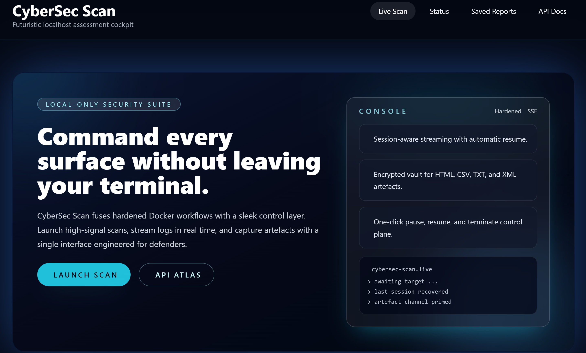

# CyberSec Scan Dashboard

## ⚠️ Disclaimer

This project is provided **for educational and research purposes only**.  
By using this software, you agree that:

- You are solely responsible for how you use it.
- The author(s) and contributors assume **no liability** for any misuse, damage, or legal issues resulting from the use of this tool.
- The tool must **only** be used on systems you own or have explicit permission to test.

**Unauthorized scanning or testing of systems you do not own is illegal.**  
Use at your own risk.

## Overview

**Local use only:** CyberSec Scan is designed for trusted hosts. Do not expose the dashboard or Docker socket to untrusted networks.

CyberSec Scan pairs a hardened Express UI with a containerised scanning engine. Launch jobs with granular tuning, monitor live output over Server-Sent Events (SSE), and archive reports under `./scans/` for follow-up analysis.

## Project Layout
- `docker-compose.yml` wires the scanner engine and the web interface, mounting `./scans/` into both services.
- `webui/app.js` hosts the Express server, session handling, SSE hub, and report-serving routes (`/scan-stream`, `/scan-pause`, `/history`, etc.).
- `webui/public/` contains the standalone dashboard assets (`index.html`, `status.html`, `swagger.html`, `styles.css`).
- `webui/views/list.html` renders the saved reports table; files in `scans/` persist completed jobs.

## Prerequisites
- Docker Desktop (or an equivalent Docker Engine) with Compose v2 support.
- Local access to `/var/run/docker.sock` so the UI container can run commands in the scanner container.
- Optional: Node.js 20+ if you intend to run the UI directly on the host for development tweaks.

## Getting Started
1. Clone the repository and work from the project root.
2. Run `docker compose up --build -d` the first time to build the CyberSec Scan UI image.
3. Open http://localhost:2609 once the `cybersec_webui` container logs "Web UI listening on port 2609".
4. Stop everything with `docker compose down` when you finish.
5. Use `docker compose logs -f webui` for live debugging of the SSE stream.

## Usage Notes
- Submit the target, optional port, tuning flags, and output format from the dashboard. Pause/Resume toggles signals `SIGSTOP`/`SIGCONT`, while Stop issues `SIGTERM`.
- Saved reports appear under `Saved Reports` and map to files in the `scans/` directory. Housekeep this folder regularly.
- Explore the REST surface through `/swagger.html` or consume `/history` + `/reports/<file>` programmatically.

## Development & Troubleshooting
- Configure `CYBERSEC_CONTAINER` / `CYBERSEC_OUTPUT_DIR` (legacy support remains for the `NIKTO_*` variables) before deploying remotely.
- When running the UI outside Docker (e.g, `node webui/app.js` on Windows), set `CYBERSEC_CONTAINER_OUTPUT_DIR` to the path mounted inside the scanner container (defaults to `/scans`). The UI normalises Windows drive letters, but an explicit override keeps multi-host setups consistent.
- Manual validation is still required; exercise safe targets (e.g., `https://example.com`) before shipping UI or report-handling changes.
- If scans stall, confirm Docker is running and the scanner container remains healthy. Permission errors on downloads usually mean the host user cannot write to `./scans`  adjust ownership and retry.

